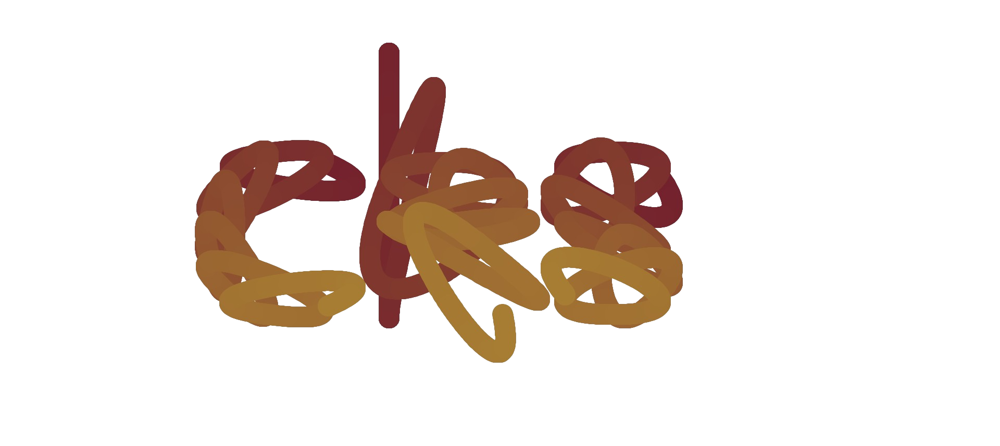

# CRSplineModules [V2.0.0]

The **CRSplineModules** are two modules that create `CatmullRomSplines` and link together `CatmullRomSplines`. In essence, CatmullRomSplines are n degree smooth parametric curves that intersect specified points in a given set. If you want to understand the concept of CatmullRomSplines in the 3rd degree, you can visit https://www.cs.cmu.edu/~fp/courses/graphics/asst5/catmullRom.pdf

## CRSplineModules on Roblox

If you want to get a copy of the CatmullRomSpline modules on Roblox, you can click the link below:

https://www.roblox.com/library/11017348135/CRSplineModules-V2-0-0

## Devforum Documentation

You can see the documentation of CRSplineModules on the devforum:

(insert link here)

---
## CRSplineModules API

`CRSplineModules` is composed of three separate `ModuleScripts`.

1. `BaseSpline` is a class that contains important properties and functions of a `Spline`. This is the base class of the next two classes.
   
2. `CatmullRomSpline` creates the basic functionality of a `CatmullRomSpline`. It takes in given points and a tension, and contains functions for calculating properties of the Spline containing the given points.

3. `CatmullRomPath` creates a path that is made by linking together several `CatmullRomSplines`. Like a `CatmullRomSpline`, it is derived from `BaseSpline`, meaning it has all the functions available for `BaseSplines`.

---

## BaseSpline

The `BaseSpline` is the basic structure of both the `CatmullRomSpline` and the `CatmullRomPath`. It contains the prototypes of functions essential to a `Spline`.

## Requiring BaseSpline

You can require the `BaseSpline` module by waiting for the module inside the `CRSplineModules` folder!

```lua
local ReplicatedStorage = game:GetService("ReplicatedStorage")
local CRSplineModules = ReplicatedStorage:WaitForChild("CRSplineModules")
local BaseSpline = require(CRSplineModules:WaitForChild("BaseSpline"))
```

## BaseSpline static functions

> | Function | Parameters | Return Type |
> | -------- | ---------- | ----------- |
> | **BaseSpline.new()** | none | `BaseSpline` |

## BaseSpline object properties

> | Property | Type | Description |
> | -------- | ---- | ----------- |
> | **BaseSpline.LengthSegments** | `number` | The number of segments to make for calculating the length of the `BaseSpline` |
> | **BaseSpline.Length** | `number` | The length of the BaseSpline |
> | **BaseSpline._LengthCache** | `LengthCache` *(see important notes)* | **Internal property**. The cache of the iteration of the BaseSpline |

*Important notes:*
```lua
type LengthCache = {
    [number]: {
         t: number,
        l: number,
    }
}
```

## BaseSpline object functions

> | Function | Parameters | Return Type |
> | -------- | ---------- | ----------- |
> | **BaseSpline:Position(t)** | `t: number` | `VectorQuantity` *(see important notes)* |
> | **BaseSpline:Velocity(t)** | `t: number` | `VectorQuantity` *(see important notes)* |
> | **BaseSpline:Acceleration(t)** | `t: number` | `VectorQuantity` *(see important notes)* |
> | **BaseSpline:Normal(t)** | `t: number` | `Vector3` |
> | **BaseSpline:Curvature(t)** | `t: number` | `number` |
> | **BaseSpline:ArcLength(t)** | `t: number` | `number` |
> | **BaseSpline:TransformRelativeToLength(t)** | `t: number` | `number` |
> | **BaseSpline:_UpdateLength()** | none | `void` |

*Important notes:*
```lua
type VectorQuantity = number | Vector2 | Vector3
```

---

## CatmullRomSpline

The `CatmullRomSpline` is responsible for making basic CatmullRomSplines consisting of four points. It is derived from the `BaseSpline` class. If a `CatmullRomSpline` is instantiated with less than four points, the object will error when using any of the `BaseSpline` functions.

## Requiring CatmullRomSpline

You can require the `CatmullRomSpline` module by waiting for it in the `CRSplineModules` folder!

```lua
local ReplicatedStorage = game:GetService("ReplicatedStorage")
local CRSplineModules = ReplicatedStorage:WaitForChild("CRSplineModules")
local CatmullRomSpline = require(CRSplineModules:WaitForChild("CatmullRomSpline"))
```

## CatmullRomSpline static functions

> | Function | Parameters | Return Type |
> | -------- | ---------- | ----------- |
> | **CatmullRomSpline.new(points, tension)** | `points: CatmullRomPoints?, tension: number?` *(see important notes)* | `CatmullRomSpline` |

## CatmullRomSpline object properties

* *Contains all properties associated with the `BaseSpline` class (see `BaseSpline`)*

> | Property | Type | Description |
> | -------- | ---- | ----------- |
> | **CatmullRomSpline.Points** | `CatmullRomPoints` *(see important notes)* | Contains the points inside the CatmullRomSpline. This can be a table of numbers, Vector2s, Vector3s, BaseParts, or a mix of Vector3s and BaseParts. |
> | **CatmullRomSpline.Tension** | `number` | The tension parameter of the CatmullRomSpline - this number affects the shape of the generated curve. |
> | **CatmullRomSpline._PointType** | `string` | **Internal property**. The type of points inside of the CatmullRomSpline object. |
> | **CatmullRomSpline._Connections** | `{[string]: RBXScriptConnection}` | **Internal property**. A table containing RBXScriptConnections associated with the CatmullRomSpline object. |

*Important notes:*
```lua
type CatmullRomPoint = number | Vector2 | Vector3 | BasePart
type CatmullRomPoints = {
    [1]: CatmullRomPoint?,
    [2]: CatmullRomPoint?,
    [3]: CatmullRomPoint?,
    [4]: CatmullRomPoint?
}
```

## CatmullRomSpline object functions

* *Contains all functions associated with the `BaseSpline` class (see `BaseSpline`)*

> | Function | Parameters | Return Type |
> | -------- | ---------- | ----------- |
> | **CatmullRomSpline:ChangeTension(tension)** | `tension: number` | `void` |
> | **CatmullRomSpline:AddPoint(point, index)** | `point: CatmullRomPoint, index: number?` | `void` |
> | **CatmullRomSpline:RemovePoint(index)** | `index: number` | `void` |
> | **CatmullRomSpline:IsValidPoint(point)** | `point: any` | `boolean` |
> | **CatmullRomSpline:GetVectorPoints()** | none | `{number} \| {Vector2} \| {Vector3}` |
> | **CatmullRomSpline:GetVectorConstants()** | none | `(VectorQuantity, VectorQuantity, VectorQuantity, VectorQuantity)` |
> | **CatmullRomSpline:_ListenToPositionChange(part)** | `part: BasePart` | `void` |
> | **CatmullRomSpline:_StopListeningToPositionChange(part)** | `part: BasePart` | `void` |

---

## CatmullRomPath

The `CatmullRomPath` is what is able to create long, smooth curves. The `CatmullRomSpline` itself has only four points, and only two of those points are points where the curve interpolates. To create long parametric curves using `CatmullRomSplines`, it is recommended to use `CatmullRomPath`, a `CatmullRomSpline` linker.

## Require CatmullRomPath

You can require the `CatmullRomPath` module by waiting for it in the `CRSplineModules` folder!

```lua
local ReplicatedStorage = game:GetService("ReplicatedStorage")
local CRSplineModules = ReplicatedStorage:WaitForChild("CRSplineModules")
local CatmullRomPath = require(CRSplineModules:WaitForChild("CatmullRomPath"))
```

## CatmullRomPath static functions

> | Function | Parameters | Return Type |
> | -------- | ---------- | ----------- |
> | **CatmullRomPath.new(splines, linkConnectedSplinesOnly)** | `splines: {CatmullRomSpline}?, linkConnectedSplinesOnly: boolean?` | `CatmullRomPath` |
> | **CatmullRomPath.fromPoints(points, tension)** | `points: CatmullRomPoints, tension: number?` | `CatmullRomPath` |

## CatmullRomPath object properties

* *Contains all properties associated with the `BaseSpline` class (see `BaseSpline`)*

> | Property | Type | Description |
> | -------- | ---- | ----------- |
> | **CatmullRomPath.LinkedSplines** | `{CatmullRomSpline}` | A list of the connected `CatmullRomSplines` in order of connection. |
> | **CatmullRomPath.LinkConnectedSplinesOnly** | `boolean` | Whether the `CatmullRomPath` should only connect splines that are connected via three points. |

## CatmullRomPath object functions

* *Contains all functions associated with the `BaseSpline` class (see `BaseSpline`)*

> | Function | Parameters | Return Type |
> | -------- | ---------- | ----------- |
> | **CatmullRomPath:LinkSpline(spline)** | `spline: CatmullRomSpline` | `void` |
> | **CatmullRomPath:UnlinkSpline(spline)** | `spline: CatmullRomSpline \| number` | `void` |
> | **CatmullRomPath:PiecewiseTransform(t)** | `t: number` | `(CatmullRomSpline, number)` |